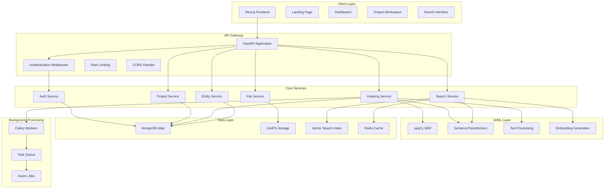

# Design Document

## Overview

CoWriteAI is a full-stack web application built with Next.js frontend and FastAPI backend, designed to provide AI-assisted writing capabilities through intelligent content indexing and semantic search. The system follows a microservices-oriented architecture with clear separation of concerns, enabling scalability and maintainability.

The platform serves writers who need to manage large creative projects, automatically extract story elements, and perform sophisticated searches across their content. The design emphasizes performance, security, and user experience while maintaining extensibility for future AI features.

## Architecture

### High-Level System Architecture



### Technology Stack

| Layer | Technology | Purpose |
|-------|------------|---------|
| **Frontend** | Next.js 15, TypeScript, Tailwind CSS | Modern React framework with SSR/SSG capabilities |
| **State Management** | Zustand | Lightweight state management for client-side data |
| **Backend** | FastAPI, Pydantic, AsyncIO | High-performance async Python API framework |
| **Authentication** | JWT + HTTP-only cookies | Secure token-based authentication |
| **Database** | MongoDB Atlas + GridFS | Document database with file storage and vector search |
| **Caching** | Redis | Session storage, query caching, and rate limiting |
| **AI/ML** | spaCy, HuggingFace, SentenceTransformers | NLP models for entity extraction and embeddings |
| **Background Jobs** | Celery + Redis | Async task processing for indexing operations |
| **Deployment** | Docker, Nginx | Containerized deployment with reverse proxy |

## Components and Interfaces

### Frontend Components

#### 1. Landing Page Component
```typescript
interface LandingPageProps {
  features: Feature[];
  testimonials: Testimonial[];
  pricingPlans: PricingPlan[];
}

interface Feature {
  id: string;
  title: string;
  description: string;
  icon: string;
  benefits: string[];
}
```

#### 2. Authentication Components
```typescript
interface AuthFormProps {
  mode: 'login' | 'register' | 'forgot-password';
  onSubmit: (credentials: UserCredentials) => Promise<void>;
  loading: boolean;
  error?: string;
}

interface UserCredentials {
  email: string;
  password: string;
  confirmPassword?: string;
}
```

#### 3. Dashboard Component
```typescript
interface DashboardProps {
  projects: Project[];
  recentActivity: Activity[];
  systemStatus: SystemStatus;
}

interface Project {
  id: string;
  name: string;
  description: string;
  fileCount: number;
  entityCount: number;
  lastModified: Date;
  indexingStatus: 'pending' | 'processing' | 'completed' | 'error';
}
```

#### 4. Project Workspace Component
```typescript
interface WorkspaceProps {
  project: Project;
  files: ProjectFile[];
  entities: Entity[];
  relationships: Relationship[];
}

interface Entity {
  id: string;
  type: 'character' | 'location' | 'theme';
  name: string;
  mentions: number;
  relationships: string[];
  confidence: number;
}
```

#### 5. Search Interface Component
```typescript
interface SearchProps {
  onSearch: (query: SearchQuery) => Promise<SearchResult[]>;
  suggestions: string[];
  filters: SearchFilter[];
}

interface SearchQuery {
  text: string;
  filters: {
    entityTypes: string[];
    dateRange?: DateRange;
    projects: string[];
  };
}

interface SearchResult {
  id: string;
  type: 'document' | 'entity';
  title: string;
  excerpt: string;
  relevanceScore: number;
  highlights: string[];
  metadata: Record<string, any>;
}
```

### Backend API Interfaces

#### 1. Authentication Endpoints
```python
# POST /api/auth/register
class UserRegistration(BaseModel):
    email: EmailStr
    password: str
    confirm_password: str

class UserResponse(BaseModel):
    id: str
    email: str
    created_at: datetime
    role: str

# POST /api/auth/login
class UserLogin(BaseModel):
    email: EmailStr
    password: str

class AuthResponse(BaseModel):
    user: UserResponse
    access_token: str
    token_type: str = "bearer"
```

#### 2. Project Management Endpoints
```python
# POST /api/projects
class ProjectCreate(BaseModel):
    name: str
    description: Optional[str] = None
    settings: Optional[Dict[str, Any]] = None

class ProjectResponse(BaseModel):
    id: str
    name: str
    description: Optional[str]
    owner_id: str
    created_at: datetime
    updated_at: datetime
    file_count: int
    entity_count: int
    indexing_status: str

# GET /api/projects/{project_id}/files
class FileUploadResponse(BaseModel):
    id: str
    filename: str
    size: int
    content_type: str
    upload_status: str
    processing_status: str
```

#### 3. Search Endpoints
```python
# POST /api/search
class SearchRequest(BaseModel):
    query: str
    project_ids: Optional[List[str]] = None
    entity_types: Optional[List[str]] = None
    limit: int = 20
    offset: int = 0

class SearchResponse(BaseModel):
    results: List[SearchResult]
    total_count: int
    query_time_ms: int
    suggestions: List[str]

class SearchResult(BaseModel):
    id: str
    type: str
    title: str
    content: str
    relevance_score: float
    highlights: List[str]
    metadata: Dict[str, Any]
```

#### 4. Entity Management Endpoints
```python
# GET /api/projects/{project_id}/entities
class EntityResponse(BaseModel):
    id: str
    type: str
    name: str
    aliases: List[str]
    mention_count: int
    confidence_score: float
    relationships: List[str]
    first_mentioned: Optional[str]
    last_mentioned: Optional[str]

class RelationshipResponse(BaseModel):
    id: str
    source_entity_id: str
    target_entity_id: str
    relationship_type: str
    strength: float
    context_snippets: List[str]
```

### Core Service Interfaces

#### 1. Authentication Service
```python
class AuthService:
    async def register_user(self, user_data: UserRegistration) -> UserResponse
    async def authenticate_user(self, credentials: UserLogin) -> Optional[User]
    async def create_access_token(self, user_id: str) -> str
    async def verify_token(self, token: str) -> Optional[str]
    async def refresh_token(self, refresh_token: str) -> str
    async def reset_password(self, email: str) -> bool
    async def verify_email(self, token: str) -> bool
```

#### 2. Project Service
```python
class ProjectService:
    async def create_project(self, user_id: str, project_data: ProjectCreate) -> Project
    async def get_user_projects(self, user_id: str) -> List[Project]
    async def get_project(self, project_id: str, user_id: str) -> Optional[Project]
    async def update_project(self, project_id: str, updates: Dict) -> Project
    async def delete_project(self, project_id: str, user_id: str) -> bool
    async def get_project_stats(self, project_id: str) -> ProjectStats
```

#### 3. File Service
```python
class FileService:
    async def upload_file(self, project_id: str, file: UploadFile) -> FileResponse
    async def get_project_files(self, project_id: str) -> List[FileResponse]
    async def delete_file(self, file_id: str) -> bool
    async def extract_text_content(self, file_id: str) -> str
    async def validate_file_type(self, file: UploadFile) -> bool
    async def sanitize_content(self, content: str) -> str
```

#### 4. Indexing Service
```python
class IndexingService:
    async def index_document(self, file_id: str, content: str) -> IndexingResult
    async def extract_entities(self, text: str) -> List[Entity]
    async def generate_embeddings(self, text_chunks: List[str]) -> List[List[float]]
    async def chunk_text(self, text: str) -> List[TextChunk]
    async def discover_relationships(self, entities: List[Entity]) -> List[Relationship]
    async def update_index(self, file_id: str) -> bool
```

#### 5. Search Service
```python
class SearchService:
    async def semantic_search(self, query: SearchRequest) -> SearchResponse
    async def generate_query_embedding(self, query: str) -> List[float]
    async def hybrid_search(self, query_vector: List[float], filters: Dict) -> List[SearchResult]
    async def get_autocomplete_suggestions(self, partial_query: str) -> List[str]
    async def cache_search_results(self, query_hash: str, results: SearchResponse) -> None
    async def get_cached_results(self, query_hash: str) -> Optional[SearchResponse]
```

## Data Models

### MongoDB Collections Schema

#### 1. Users Collection
```javascript
{
  _id: ObjectId,
  email: String, // unique index
  password_hash: String,
  role: String, // 'user' | 'admin'
  email_verified: Boolean,
  created_at: Date,
  updated_at: Date,
  last_login: Date,
  settings: {
    theme: String,
    notifications: Boolean,
    language: String
  }
}
```

#### 2. Projects Collection
```javascript
{
  _id: ObjectId,
  name: String,
  description: String,
  owner_id: ObjectId, // reference to users
  created_at: Date,
  updated_at: Date,
  settings: {
    indexing_enabled: Boolean,
    entity_extraction_threshold: Number,
    auto_reindex: Boolean
  },
  stats: {
    file_count: Number,
    entity_count: Number,
    total_words: Number,
    last_indexed: Date
  },
  indexing_status: String // 'pending' | 'processing' | 'completed' | 'error'
}
```

#### 3. Files Collection
```javascript
{
  _id: ObjectId,
  project_id: ObjectId,
  filename: String,
  original_filename: String,
  content_type: String,
  size: Number,
  gridfs_id: ObjectId, // reference to GridFS
  text_content: String, // extracted and cleaned text
  upload_status: String,
  processing_status: String,
  created_at: Date,
  updated_at: Date,
  metadata: {
    word_count: Number,
    chapter_count: Number,
    language: String
  }
}
```

#### 4. Entities Collection
```javascript
{
  _id: ObjectId,
  project_id: ObjectId,
  type: String, // 'character' | 'location' | 'theme'
  name: String,
  aliases: [String],
  confidence_score: Number,
  mention_count: Number,
  first_mentioned: {
    file_id: ObjectId,
    position: Number,
    context: String
  },
  last_mentioned: {
    file_id: ObjectId,
    position: Number,
    context: String
  },
  attributes: {
    // flexible schema for entity-specific data
  },
  created_at: Date,
  updated_at: Date
}
```

#### 5. Text Chunks Collection
```javascript
{
  _id: ObjectId,
  file_id: ObjectId,
  project_id: ObjectId,
  content: String,
  start_position: Number,
  end_position: Number,
  chunk_index: Number,
  word_count: Number,
  embedding_vector: [Number], // vector search index
  entities_mentioned: [ObjectId],
  created_at: Date
}
```

#### 6. Relationships Collection
```javascript
{
  _id: ObjectId,
  project_id: ObjectId,
  source_entity_id: ObjectId,
  target_entity_id: ObjectId,
  relationship_type: String, // 'appears_with' | 'located_in' | 'related_to'
  strength: Number, // 0.0 to 1.0
  co_occurrence_count: Number,
  context_snippets: [String],
  created_at: Date,
  updated_at: Date
}
```

#### 7. Search Logs Collection
```javascript
{
  _id: ObjectId,
  user_id: ObjectId,
  project_id: ObjectId,
  query: String,
  query_hash: String, // for caching
  result_count: Number,
  response_time_ms: Number,
  clicked_results: [ObjectId],
  created_at: Date
}
```

### Vector Search Index Configuration
```javascript
// MongoDB Atlas Vector Search Index on text_chunks collection
{
  "fields": [
    {
      "type": "vector",
      "path": "embedding_vector",
      "numDimensions": 384, // for all-MiniLM-L6-v2
      "similarity": "cosine"
    },
    {
      "type": "filter",
      "path": "project_id"
    },
    {
      "type": "filter", 
      "path": "file_id"
    }
  ]
}
```

## Error Handling

### Error Response Schema
```python
class ErrorResponse(BaseModel):
    error: str
    message: str
    details: Optional[Dict[str, Any]] = None
    timestamp: datetime
    request_id: str

class ValidationErrorResponse(BaseModel):
    error: str = "validation_error"
    message: str
    field_errors: Dict[str, List[str]]
    timestamp: datetime
    request_id: str
```

### Error Categories and Handling

#### 1. Authentication Errors
- **401 Unauthorized**: Invalid or expired tokens
- **403 Forbidden**: Insufficient permissions
- **422 Validation Error**: Invalid login credentials format

#### 2. File Upload Errors
- **413 Payload Too Large**: File size exceeds limits
- **415 Unsupported Media Type**: Invalid file format
- **422 Validation Error**: File content validation failures

#### 3. Processing Errors
- **500 Internal Server Error**: Indexing pipeline failures
- **503 Service Unavailable**: AI model loading issues
- **429 Too Many Requests**: Rate limiting exceeded

#### 4. Search Errors
- **400 Bad Request**: Invalid query parameters
- **404 Not Found**: Project or entity not found
- **408 Request Timeout**: Search query timeout

### Error Recovery Strategies

#### 1. Retry Logic
```python
@retry(
    stop=stop_after_attempt(3),
    wait=wait_exponential(multiplier=1, min=4, max=10),
    retry=retry_if_exception_type(ConnectionError)
)
async def robust_api_call():
    # Implementation with automatic retry
    pass
```

#### 2. Circuit Breaker Pattern
```python
class CircuitBreaker:
    def __init__(self, failure_threshold: int = 5, timeout: int = 60):
        self.failure_threshold = failure_threshold
        self.timeout = timeout
        self.failure_count = 0
        self.last_failure_time = None
        self.state = "CLOSED"  # CLOSED, OPEN, HALF_OPEN
```

#### 3. Graceful Degradation
- Search falls back to keyword matching if semantic search fails
- Entity extraction continues with reduced confidence if AI models are unavailable
- File uploads queue for later processing if indexing service is down

## Testing Strategy

### Testing Pyramid

#### 1. Unit Tests (70%)
```python
# Example test structure
class TestAuthService:
    async def test_register_user_success(self):
        # Test successful user registration
        pass
    
    async def test_register_user_duplicate_email(self):
        # Test duplicate email handling
        pass
    
    async def test_authenticate_user_invalid_credentials(self):
        # Test authentication failure
        pass

class TestIndexingService:
    async def test_extract_entities_from_text(self):
        # Test entity extraction accuracy
        pass
    
    async def test_generate_embeddings(self):
        # Test embedding generation
        pass
```

#### 2. Integration Tests (20%)
```python
class TestProjectWorkflow:
    async def test_complete_project_creation_flow(self):
        # Test: Create project -> Upload file -> Index content -> Search
        pass
    
    async def test_file_upload_and_processing_pipeline(self):
        # Test: File upload -> Text extraction -> Entity extraction -> Indexing
        pass

class TestSearchWorkflow:
    async def test_semantic_search_end_to_end(self):
        # Test: Query -> Embedding -> Vector search -> Result ranking
        pass
```

#### 3. End-to-End Tests (10%)
```python
class TestUserJourney:
    async def test_new_user_complete_workflow(self):
        # Test: Registration -> Login -> Create project -> Upload -> Search
        pass
    
    async def test_project_collaboration_workflow(self):
        # Test: Share project -> Collaborative editing -> Search across shared content
        pass
```

### Performance Testing

#### 1. Load Testing
- Simulate 100+ concurrent users
- Test file upload under load
- Measure search response times under concurrent queries
- Validate indexing performance with large documents

#### 2. Stress Testing
- Test system behavior at 2x expected load
- Validate graceful degradation under resource constraints
- Test memory usage with large file uploads
- Validate database connection pooling

#### 3. Performance Benchmarks
```python
class PerformanceBenchmarks:
    async def test_indexing_speed(self):
        # Target: 10,000 words in < 3 seconds
        pass
    
    async def test_search_latency(self):
        # Target: < 250ms response time
        pass
    
    async def test_concurrent_uploads(self):
        # Target: Handle 10 concurrent file uploads
        pass
```

### Security Testing

#### 1. Authentication Security
- Test JWT token expiration and refresh
- Validate password hashing strength
- Test session management security
- Validate rate limiting effectiveness

#### 2. Input Validation
- Test file upload security (malicious files)
- Validate SQL injection prevention
- Test XSS prevention in search queries
- Validate CSRF protection

#### 3. API Security
- Test authorization on all endpoints
- Validate input sanitization
- Test rate limiting bypass attempts
- Validate HTTPS enforcement

This comprehensive design provides a solid foundation for building a production-ready CoWriteAI platform that meets all the specified requirements while maintaining scalability, security, and performance standards.