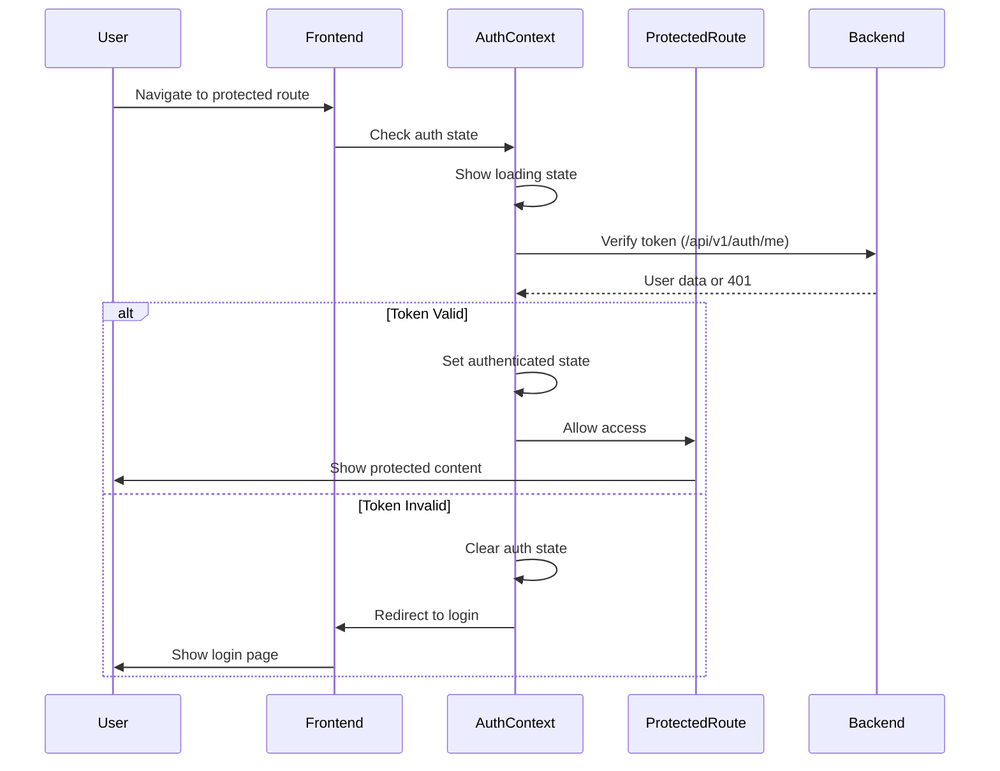
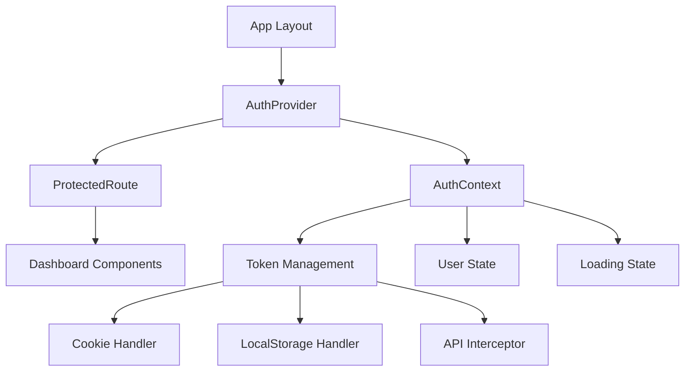

# Design Document

## Overview

The authentication flow issue stems from a race condition and inconsistent token management between the frontend and backend. The current implementation has several problems:

1. **Token Storage Mismatch**: Backend sets HTTP-only cookies but frontend expects localStorage tokens
2. **Race Condition**: ProtectedRoute component renders content before authentication verification completes
3. **Inconsistent Token Validation**: Frontend and backend use different token sources
4. **Missing Loading States**: Users see protected content briefly before redirect

This design addresses these issues by implementing a unified authentication state management system with proper loading states and consistent token handling.

## Architecture

### Authentication Flow Architecture



### Component Architecture



## Components and Interfaces

### 1. AuthContext Provider

**Purpose**: Centralized authentication state management

**Interface**:
```typescript
interface AuthContextType {
  user: User | null;
  loading: boolean;
  isAuthenticated: boolean;
  login: (credentials: LoginCredentials) => Promise<void>;
  logout: () => Promise<void>;
  refreshToken: () => Promise<boolean>;
  checkAuth: () => Promise<void>;
}
```

**Key Features**:
- Manages authentication state globally
- Handles token refresh automatically
- Provides loading states for UI
- Centralizes all auth-related API calls

### 2. Enhanced ProtectedRoute Component

**Purpose**: Route-level authentication guard with proper loading states

**Interface**:
```typescript
interface ProtectedRouteProps {
  children: ReactNode;
  requireAuth?: boolean;
  redirectTo?: string;
  fallback?: ReactNode;
}
```

**Key Features**:
- Shows loading spinner during auth verification
- Prevents content flash before redirect
- Supports custom fallback components
- Integrates with AuthContext for state

### 3. Token Management Service

**Purpose**: Unified token handling across storage methods

**Interface**:
```typescript
interface TokenManager {
  getToken(): string | null;
  setToken(token: string): void;
  removeToken(): void;
  isTokenExpired(token: string): boolean;
}
```

**Key Features**:
- Supports both cookies and localStorage
- Handles token expiration checking
- Provides fallback mechanisms
- Integrates with API client

### 4. Enhanced API Client

**Purpose**: Consistent authentication handling for all API requests

**Key Features**:
- Automatic token attachment from multiple sources
- Token refresh on 401 responses
- Proper error handling and user feedback
- Request/response interceptors for auth

## Data Models

### Authentication State

```typescript
interface AuthState {
  user: User | null;
  loading: boolean;
  error: string | null;
  isAuthenticated: boolean;
  tokenExpiry: Date | null;
}
```

### Token Response

```typescript
interface TokenResponse {
  access_token: string;
  refresh_token: string;
  token_type: string;
  expires_in: number;
}
```

### User Model

```typescript
interface User {
  id: string;
  email: string;
  role: string;
  email_verified: boolean;
  created_at: string;
  settings: UserSettings;
}
```

## Error Handling

### Frontend Error Handling

1. **Network Errors**: Show retry mechanism with exponential backoff
2. **401 Unauthorized**: Attempt token refresh, then redirect to login
3. **403 Forbidden**: Show access denied message
4. **Token Expiry**: Automatic refresh or logout based on refresh token validity

### Backend Error Handling

1. **Invalid Tokens**: Return consistent 401 responses
2. **Expired Tokens**: Distinguish between access and refresh token expiry
3. **Rate Limiting**: Implement progressive delays for auth attempts
4. **CORS Issues**: Ensure proper origin validation

### Error Recovery Strategies

1. **Token Refresh**: Automatic retry with refresh token
2. **Fallback Storage**: Try cookies if localStorage fails
3. **Graceful Degradation**: Allow anonymous access where appropriate
4. **User Feedback**: Clear error messages with actionable steps

## Testing Strategy

### Unit Tests

1. **AuthContext**: Test state transitions and error handling
2. **ProtectedRoute**: Test loading states and redirect logic
3. **TokenManager**: Test token validation and storage methods
4. **API Client**: Test interceptors and retry logic

### Integration Tests

1. **Login Flow**: End-to-end authentication process
2. **Token Refresh**: Automatic token renewal scenarios
3. **Route Protection**: Access control for protected routes
4. **Error Scenarios**: Network failures and invalid tokens

### E2E Tests

1. **User Journey**: Complete login to dashboard flow
2. **Session Management**: Token expiry and refresh scenarios
3. **Cross-tab Sync**: Authentication state across browser tabs
4. **Security**: Token handling and storage security

## Implementation Phases

### Phase 1: Core Authentication Context
- Create AuthProvider with centralized state management
- Implement token management service
- Add proper loading states

### Phase 2: Enhanced Route Protection
- Update ProtectedRoute with AuthContext integration
- Add loading spinners and error boundaries
- Implement proper redirect logic

### Phase 3: API Client Enhancement
- Update interceptors for consistent token handling
- Add automatic token refresh logic
- Improve error handling and user feedback

### Phase 4: Backend Consistency
- Ensure consistent token validation
- Fix cookie/localStorage token source handling
- Add proper CORS and security headers

### Phase 5: Testing and Validation
- Comprehensive test coverage
- Performance optimization
- Security audit and validation