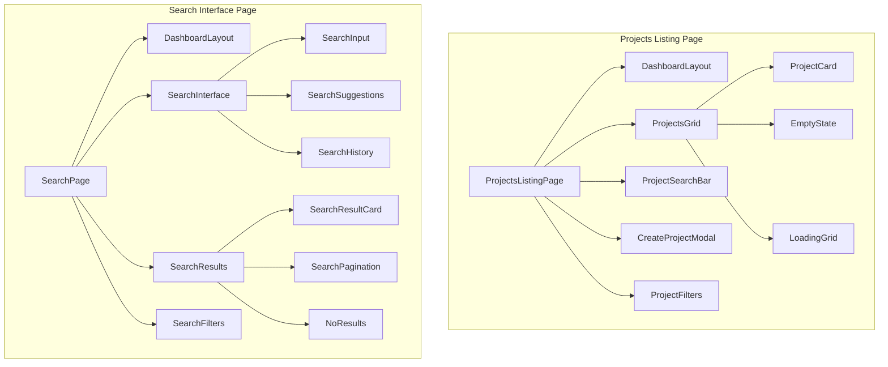

# Design Document

## Overview

This design addresses the critical routing issues in the CoWriteAI platform by implementing missing frontend pages and ensuring proper navigation flow. The solution focuses on creating a projects listing page at `/dashboard/projects` and a comprehensive search interface at `/dashboard/search`, while integrating these pages seamlessly into the existing application architecture.

The design leverages the existing backend APIs and component library, ensuring consistency with the current design system while providing the missing user interface elements that are causing 404 errors.

## Architecture

### Route Structure

```mermaid
graph TD
    A[/dashboard] --> B[Dashboard Home]
    A --> C[/dashboard/projects]
    A --> D[/dashboard/search]
    
    C --> E[Projects Listing Page]
    C --> F[/dashboard/projects/[id]]
    
    F --> G[Individual Project Workspace]
    F --> H[/dashboard/projects/[id]/files]
    
    D --> I[Search Interface Page]
    
    E --> J[Project Cards Grid]
    E --> K[Create Project Modal]
    E --> L[Project Search/Filter]
    
    I --> M[Search Input & Filters]
    I --> N[Search Results Display]
    I --> O[Search History/Saved]
```

### Component Hierarchy



## Components and Interfaces

### 1. Projects Listing Page Component

```typescript
// src/app/dashboard/projects/page.tsx
interface ProjectsListingPageProps {}

interface ProjectsGridProps {
  projects: Project[];
  loading: boolean;
  onProjectClick: (projectId: string) => void;
  onProjectDelete: (projectId: string) => void;
  onRefresh: () => void;
}

interface ProjectSearchBarProps {
  onSearch: (query: string) => void;
  onFilter: (filters: ProjectFilters) => void;
  placeholder?: string;
}

interface ProjectFilters {
  sortBy: 'name' | 'created_at' | 'updated_at';
  sortOrder: 'asc' | 'desc';
  status?: 'all' | 'processing' | 'completed' | 'error';
}
```

### 2. Search Interface Page Component

```typescript
// src/app/dashboard/search/page.tsx
interface SearchPageProps {}

interface SearchInterfaceProps {
  onSearch: (query: SearchQuery) => void;
  suggestions: string[];
  history: SearchHistory[];
}

interface SearchQuery {
  text: string;
  filters: {
    projects: string[];
    entityTypes: string[];
    dateRange?: DateRange;
    contentTypes: string[];
  };
  pagination: {
    page: number;
    limit: number;
  };
}

interface SearchResultsProps {
  results: SearchResult[];
  loading: boolean;
  totalCount: number;
  onResultClick: (result: SearchResult) => void;
  onLoadMore: () => void;
}
```

### 3. Enhanced Navigation Component

```typescript
interface NavigationProps {
  currentPath: string;
  user: User;
}

interface BreadcrumbProps {
  items: BreadcrumbItem[];
}

interface BreadcrumbItem {
  label: string;
  href?: string;
  current?: boolean;
}
```

### 4. Project Card Component

```typescript
interface ProjectCardProps {
  project: Project;
  onClick: (projectId: string) => void;
  onDelete?: (projectId: string) => void;
  showActions?: boolean;
}

interface ProjectCardData extends Project {
  stats: {
    fileCount: number;
    entityCount: number;
    wordCount: number;
    lastActivity: Date;
  };
  indexingStatus: 'pending' | 'processing' | 'completed' | 'error';
}
```

### 5. Search Result Card Component

```typescript
interface SearchResultCardProps {
  result: SearchResult;
  onClick: (result: SearchResult) => void;
  showProject?: boolean;
}

interface SearchResult {
  id: string;
  type: 'document' | 'entity' | 'chunk';
  title: string;
  content: string;
  excerpt: string;
  highlights: string[];
  relevanceScore: number;
  project: {
    id: string;
    name: string;
  };
  metadata: {
    fileId?: string;
    entityType?: string;
    chunkIndex?: number;
    wordCount?: number;
  };
}
```

## Data Models

### Frontend State Management

```typescript
// Projects Listing State
interface ProjectsListingState {
  projects: Project[];
  filteredProjects: Project[];
  loading: boolean;
  error: string | null;
  searchQuery: string;
  filters: ProjectFilters;
  pagination: {
    page: number;
    limit: number;
    total: number;
  };
}

// Search State
interface SearchState {
  query: SearchQuery;
  results: SearchResult[];
  suggestions: string[];
  history: SearchHistory[];
  loading: boolean;
  error: string | null;
  totalCount: number;
  hasMore: boolean;
}

// Navigation State
interface NavigationState {
  currentPath: string;
  breadcrumbs: BreadcrumbItem[];
  sidebarOpen: boolean;
  mobileMenuOpen: boolean;
}
```

### API Integration

```typescript
// Projects API Extensions
interface ProjectsAPI {
  list(params?: ProjectListParams): Promise<Project[]>;
  search(query: string): Promise<Project[]>;
  getStats(projectId: string): Promise<ProjectStats>;
  delete(projectId: string): Promise<void>;
}

interface ProjectListParams {
  search?: string;
  sortBy?: string;
  sortOrder?: 'asc' | 'desc';
  status?: string;
  page?: number;
  limit?: number;
}

// Search API Integration
interface SearchAPI {
  search(query: SearchQuery): Promise<SearchResponse>;
  getSuggestions(partial: string): Promise<string[]>;
  getHistory(userId: string): Promise<SearchHistory[]>;
  saveSearch(query: SearchQuery): Promise<void>;
}

interface SearchResponse {
  results: SearchResult[];
  totalCount: number;
  queryTime: number;
  suggestions: string[];
  facets: SearchFacets;
}
```

## Error Handling

### Route-Level Error Handling

```typescript
// 404 Error Boundary for Missing Routes
class RouteErrorBoundary extends React.Component {
  static getDerivedStateFromError(error: Error) {
    return { hasError: true, error };
  }

  render() {
    if (this.state.hasError) {
      return <NotFoundPage />;
    }
    return this.props.children;
  }
}

// Custom 404 Page Component
interface NotFoundPageProps {
  suggestedRoutes?: string[];
  returnPath?: string;
}
```

### API Error Handling

```typescript
// Projects Loading Error States
interface ProjectsErrorState {
  type: 'network' | 'permission' | 'server' | 'not_found';
  message: string;
  retryable: boolean;
  suggestedActions: string[];
}

// Search Error States
interface SearchErrorState {
  type: 'query_invalid' | 'timeout' | 'server_error' | 'no_results';
  message: string;
  suggestions: string[];
  fallbackResults?: SearchResult[];
}
```

### Error Recovery Strategies

1. **Automatic Retry Logic**
   - Network errors: 3 retries with exponential backoff
   - Timeout errors: Single retry with increased timeout
   - Server errors: User-initiated retry only

2. **Graceful Degradation**
   - Projects page: Show cached projects if API fails
   - Search page: Fall back to client-side filtering
   - Navigation: Always provide working breadcrumbs

3. **User Feedback**
   - Clear error messages with actionable suggestions
   - Loading states with progress indication
   - Success feedback for completed actions

## Testing Strategy

### Unit Tests

```typescript
// Projects Listing Tests
describe('ProjectsListingPage', () => {
  test('renders projects grid correctly', () => {});
  test('handles search and filtering', () => {});
  test('navigates to individual projects', () => {});
  test('handles empty states', () => {});
  test('handles loading states', () => {});
  test('handles error states', () => {});
});

// Search Page Tests
describe('SearchPage', () => {
  test('performs semantic search correctly', () => {});
  test('displays search results with highlighting', () => {});
  test('handles search filters and pagination', () => {});
  test('manages search history', () => {});
  test('navigates to search results', () => {});
});
```

### Integration Tests

```typescript
// Navigation Flow Tests
describe('Navigation Integration', () => {
  test('dashboard to projects listing navigation', () => {});
  test('projects listing to individual project navigation', () => {});
  test('search results to project content navigation', () => {});
  test('breadcrumb navigation functionality', () => {});
});

// API Integration Tests
describe('API Integration', () => {
  test('projects listing API integration', () => {});
  test('search API integration with filters', () => {});
  test('error handling for failed API calls', () => {});
});
```

### End-to-End Tests

```typescript
// User Journey Tests
describe('User Journeys', () => {
  test('complete projects management workflow', () => {
    // Navigate to projects → Create project → Upload files → Search content
  });
  
  test('search and discovery workflow', () => {
    // Perform search → Filter results → Navigate to content → Return to search
  });
  
  test('mobile responsive navigation', () => {
    // Test all navigation flows on mobile viewport
  });
});
```

## Performance Considerations

### Loading Optimization

1. **Projects Listing**
   - Implement virtual scrolling for large project lists
   - Use skeleton screens during loading
   - Cache project metadata for faster subsequent loads
   - Implement search debouncing (300ms delay)

2. **Search Interface**
   - Debounce search queries (500ms delay)
   - Cache search results for 5 minutes
   - Implement infinite scroll for search results
   - Preload search suggestions

3. **Navigation**
   - Preload critical route components
   - Use Next.js Link prefetching for navigation
   - Implement route-based code splitting

### Memory Management

```typescript
// Cleanup strategies for large datasets
useEffect(() => {
  return () => {
    // Cleanup search results when leaving page
    searchStore.clearResults();
    // Cancel pending API requests
    abortController.abort();
  };
}, []);

// Pagination for large project lists
const PROJECTS_PER_PAGE = 20;
const MAX_CACHED_PAGES = 5;
```

## Security Considerations

### Route Protection

```typescript
// Protected route wrapper
function withAuth<T>(Component: React.ComponentType<T>) {
  return function AuthenticatedComponent(props: T) {
    const { user, loading } = useAuth();
    
    if (loading) return <LoadingSpinner />;
    if (!user) return <Navigate to="/auth/login" />;
    
    return <Component {...props} />;
  };
}
```

### Input Sanitization

```typescript
// Search query sanitization
function sanitizeSearchQuery(query: string): string {
  return query
    .trim()
    .replace(/[<>]/g, '') // Remove potential XSS vectors
    .substring(0, 500); // Limit query length
}

// Project name validation
function validateProjectName(name: string): boolean {
  return /^[a-zA-Z0-9\s\-_]{1,100}$/.test(name);
}
```

This design provides a comprehensive solution for fixing the routing issues while maintaining consistency with the existing application architecture and ensuring a smooth user experience across all new pages and navigation flows.