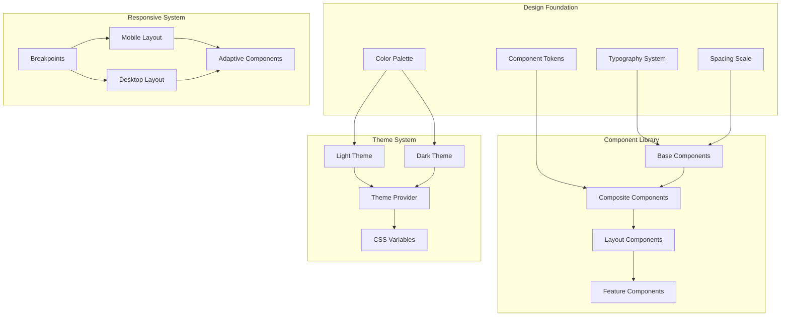

# Design Document

## Overview

The CoWriteAI frontend redesign will transform the current interface to match modern design standards inspired by the reference implementation. The design focuses on creating a professional, polished user experience with sophisticated typography, consistent spacing, modern component styling, and smooth interactions. The redesign maintains all existing functionality while significantly enhancing the visual appeal and user experience.

The design system will be based on shadcn/ui patterns with custom theming, using Geist Sans and Playfair Display fonts for a professional writing-focused aesthetic. The interface will feature subtle animations, proper visual hierarchy, and responsive design that works seamlessly across all devices.

## Architecture

### Design System Architecture



### Technology Stack Enhancement

| Layer | Current | Enhanced | Purpose |
|-------|---------|----------|---------|
| **Fonts** | System fonts | Geist Sans + Playfair Display | Professional typography |
| **UI Components** | Custom CSS | shadcn/ui patterns | Modern component library |
| **Animations** | Basic transitions | Framer Motion patterns | Smooth micro-interactions |
| **Icons** | Lucide React | Enhanced Lucide + custom | Consistent iconography |
| **Styling** | Tailwind CSS | Enhanced Tailwind + CSS variables | Advanced theming |
| **Layout** | Basic responsive | Advanced responsive + container queries | Modern responsive design |

## Components and Interfaces

### Enhanced Typography System

#### Font Configuration
```typescript
// Font imports and configuration
import { GeistSans } from "geist/font/sans"
import { GeistMono } from "geist/font/mono"
import { Playfair_Display } from "next/font/google"

const playfair = Playfair_Display({
  subsets: ["latin"],
  variable: "--font-playfair",
  display: "swap",
})

// Typography scale
interface TypographyScale {
  display: string;    // 4xl-7xl for hero sections
  heading: string;    // xl-3xl for section headers
  title: string;      // lg-xl for card titles
  body: string;       // sm-base for content
  caption: string;    // xs-sm for metadata
}
```

#### Typography Classes
```css
.font-serif { font-family: var(--font-playfair); }
.font-sans { font-family: var(--font-geist-sans); }
.font-mono { font-family: var(--font-geist-mono); }

/* Responsive typography */
.text-display { @apply text-4xl md:text-6xl lg:text-7xl font-bold; }
.text-heading { @apply text-2xl md:text-3xl lg:text-4xl font-bold; }
.text-title { @apply text-lg md:text-xl font-semibold; }
.text-body { @apply text-sm md:text-base; }
.text-caption { @apply text-xs md:text-sm; }
```

### Enhanced Color System

#### Color Palette
```css
:root {
  /* Beige/neutral theme inspired by reference */
  --background: oklch(0.96 0.01 85);
  --foreground: oklch(0.25 0.02 75);
  --card: oklch(0.98 0.008 85);
  --card-foreground: oklch(0.25 0.02 75);
  --primary: oklch(0.45 0.08 65);
  --primary-foreground: oklch(0.98 0.008 85);
  --secondary: oklch(0.88 0.015 80);
  --accent: oklch(0.65 0.12 55);
  --muted: oklch(0.92 0.012 82);
  --border: oklch(0.88 0.015 80);
  --ring: oklch(0.45 0.08 65);
}

.dark {
  --background: oklch(0.145 0 0);
  --foreground: oklch(0.985 0 0);
  --card: oklch(0.145 0 0);
  --primary: oklch(0.985 0 0);
  --secondary: oklch(0.269 0 0);
  --accent: oklch(0.269 0 0);
  --muted: oklch(0.269 0 0);
  --border: oklch(0.269 0 0);
}
```

### Enhanced Component Library

#### Button Component
```typescript
interface ButtonProps {
  variant: 'default' | 'destructive' | 'outline' | 'secondary' | 'ghost' | 'link';
  size: 'default' | 'sm' | 'lg' | 'icon';
  className?: string;
  asChild?: boolean;
}

// Enhanced button variants with modern styling
const buttonVariants = cva(
  "inline-flex items-center justify-center gap-2 whitespace-nowrap rounded-md text-sm font-medium transition-all disabled:pointer-events-none disabled:opacity-50 focus-visible:ring-ring/50 focus-visible:ring-[3px]",
  {
    variants: {
      variant: {
        default: "bg-primary text-primary-foreground shadow-xs hover:bg-primary/90",
        destructive: "bg-destructive text-white shadow-xs hover:bg-destructive/90",
        outline: "border bg-background shadow-xs hover:bg-accent hover:text-accent-foreground",
        secondary: "bg-secondary text-secondary-foreground shadow-xs hover:bg-secondary/80",
        ghost: "hover:bg-accent hover:text-accent-foreground",
        link: "text-primary underline-offset-4 hover:underline",
      },
      size: {
        default: "h-9 px-4 py-2",
        sm: "h-8 rounded-md gap-1.5 px-3",
        lg: "h-10 rounded-md px-6",
        icon: "size-9",
      },
    },
  }
)
```

#### Card Component
```typescript
interface CardProps {
  className?: string;
  children: React.ReactNode;
}

// Enhanced card with modern styling
function Card({ className, ...props }: CardProps) {
  return (
    <div
      className={cn(
        "bg-card text-card-foreground flex flex-col gap-6 rounded-xl border py-6 shadow-sm",
        className,
      )}
      {...props}
    />
  )
}
```

#### Input Component
```typescript
interface InputProps extends React.InputHTMLAttributes<HTMLInputElement> {
  error?: string;
  label?: string;
  description?: string;
}

function Input({ className, error, label, description, ...props }: InputProps) {
  return (
    <div className="space-y-2">
      {label && (
        <label className="text-sm font-medium leading-none peer-disabled:cursor-not-allowed peer-disabled:opacity-70">
          {label}
        </label>
      )}
      <input
        className={cn(
          "flex h-9 w-full rounded-md border border-input bg-transparent px-3 py-1 text-sm shadow-sm transition-colors file:border-0 file:bg-transparent file:text-sm file:font-medium placeholder:text-muted-foreground focus-visible:outline-none focus-visible:ring-1 focus-visible:ring-ring disabled:cursor-not-allowed disabled:opacity-50",
          error && "border-destructive focus-visible:ring-destructive",
          className
        )}
        {...props}
      />
      {description && (
        <p className="text-xs text-muted-foreground">{description}</p>
      )}
      {error && (
        <p className="text-xs text-destructive">{error}</p>
      )}
    </div>
  )
}
```

### Enhanced Layout Components

#### Landing Page Layout
```typescript
interface LandingPageProps {
  children: React.ReactNode;
}

function LandingPage({ children }: LandingPageProps) {
  return (
    <div className="min-h-screen bg-background">
      {/* Enhanced header with backdrop blur */}
      <header className="border-b border-border/40 bg-card/50 backdrop-blur-sm sticky top-0 z-50">
        <div className="container mx-auto px-6 py-4 flex items-center justify-between">
          <div className="flex items-center gap-2">
            <BookOpen className="h-7 w-7 text-primary" />
            <span className="font-serif text-2xl font-bold text-foreground">CoWriteAI</span>
          </div>
          <nav className="flex items-center gap-6">
            <Link href="/login" className="text-sm font-medium text-muted-foreground hover:text-foreground transition-colors">
              Login
            </Link>
            <Button asChild size="sm" className="rounded-full">
              <Link href="/signup">Get Started</Link>
            </Button>
          </nav>
        </div>
      </header>
      
      {children}
      
      {/* Enhanced footer */}
      <footer className="border-t border-border/40 bg-card/30 mt-20">
        <div className="container mx-auto px-6 py-12">
          <div className="flex flex-col md:flex-row items-center justify-between gap-6">
            <div className="flex items-center gap-2">
              <BookOpen className="h-6 w-6 text-primary" />
              <span className="font-serif text-xl font-bold text-foreground">CoWriteAI</span>
            </div>
            <p className="text-sm text-muted-foreground">© 2025 CoWriteAI. Empowering creative writers worldwide.</p>
          </div>
        </div>
      </footer>
    </div>
  )
}
```

#### Dashboard Layout
```typescript
interface DashboardLayoutProps {
  children: React.ReactNode;
}

function DashboardLayout({ children }: DashboardLayoutProps) {
  return (
    <div className="min-h-screen bg-background">
      {/* Enhanced dashboard header */}
      <header className="border-b border-border/40 bg-card/50 backdrop-blur-sm sticky top-0 z-50">
        <div className="container mx-auto px-6 py-4 flex items-center justify-between">
          <div className="flex items-center gap-2">
            <BookOpen className="h-7 w-7 text-primary" />
            <span className="font-serif text-2xl font-bold text-foreground">CoWriteAI</span>
          </div>
          
          <div className="flex items-center gap-4">
            <ThemeToggle />
            <UserMenu />
          </div>
        </div>
      </header>
      
      <main className="container mx-auto px-6 py-12">
        {children}
      </main>
    </div>
  )
}
```

#### Workspace Layout
```typescript
interface WorkspaceLayoutProps {
  project: Project;
  children: React.ReactNode;
}

function WorkspaceLayout({ project, children }: WorkspaceLayoutProps) {
  return (
    <div className="min-h-screen bg-background flex flex-col">
      {/* Workspace header */}
      <header className="border-b border-border bg-card px-6 py-3">
        <div className="flex items-center justify-between">
          <div className="flex items-center gap-3">
            <Button variant="ghost" size="icon" asChild>
              <Link href="/dashboard">
                <ArrowLeft className="h-4 w-4" />
              </Link>
            </Button>
            <div>
              <h1 className="font-serif text-xl font-semibold">{project.title}</h1>
              <p className="text-sm text-muted-foreground">{project.description}</p>
            </div>
          </div>
          
          <div className="flex items-center gap-2">
            <ProcessingStatus project={project} />
            <ThemeToggle />
          </div>
        </div>
      </header>
      
      {/* VS Code-style layout */}
      <div className="flex-1 flex overflow-hidden">
        <aside className="w-80 border-r border-border bg-card/50">
          <FileTreeSidebar project={project} />
        </aside>
        
        <main className="flex-1 overflow-auto">
          {children}
        </main>
      </div>
    </div>
  )
}
```

### Enhanced Feature Components

#### Project Card Component
```typescript
interface ProjectCardProps {
  project: Project;
  onOpen: (projectId: string) => void;
  onDelete: (project: Project) => void;
}

function ProjectCard({ project, onOpen, onDelete }: ProjectCardProps) {
  return (
    <div
      className="group bg-card border border-border rounded-2xl p-6 hover:shadow-lg hover:border-primary/30 transition-all duration-300 cursor-pointer animate-fade-in-up"
      onClick={() => onOpen(project.id)}
    >
      <div className="flex items-start justify-between mb-4">
        <div className="h-12 w-12 rounded-xl bg-primary/10 flex items-center justify-center group-hover:scale-110 transition-transform">
          <BookOpen className="h-6 w-6 text-primary" />
        </div>
        
        <DropdownMenu>
          <DropdownMenuTrigger asChild onClick={(e) => e.stopPropagation()}>
            <Button variant="ghost" size="icon" className="h-8 w-8 opacity-0 group-hover:opacity-100 transition-opacity">
              <MoreVertical className="h-4 w-4" />
            </Button>
          </DropdownMenuTrigger>
          <DropdownMenuContent align="end">
            <DropdownMenuItem onClick={(e) => { e.stopPropagation(); onOpen(project.id); }}>
              <FolderOpen className="h-4 w-4 mr-2" />
              Open Project
            </DropdownMenuItem>
            <DropdownMenuSeparator />
            <DropdownMenuItem 
              onClick={(e) => { e.stopPropagation(); onDelete(project); }}
              className="text-destructive"
            >
              <Trash2 className="h-4 w-4 mr-2" />
              Delete
            </DropdownMenuItem>
          </DropdownMenuContent>
        </DropdownMenu>
      </div>
      
      <h3 className="font-serif text-xl font-semibold text-foreground mb-2 line-clamp-1">
        {project.title}
      </h3>
      <p className="text-sm text-muted-foreground mb-4 line-clamp-2 leading-relaxed">
        {project.description || "No description"}
      </p>
      
      <div className="flex items-center justify-between text-xs text-muted-foreground pt-4 border-t border-border">
        <div className="flex items-center gap-1">
          <Clock className="h-3.5 w-3.5" />
          {formatLastModified(project.updated_at)}
        </div>
        <div>{project.stats.total_words.toLocaleString()} words</div>
      </div>
    </div>
  )
}
```

#### Search Interface Component
```typescript
interface SearchInterfaceProps {
  onSearch: (query: string) => void;
  suggestions: string[];
  loading: boolean;
}

function SearchInterface({ onSearch, suggestions, loading }: SearchInterfaceProps) {
  return (
    <div className="space-y-6">
      {/* Enhanced search input */}
      <div className="relative">
        <Search className="absolute left-4 top-1/2 -translate-y-1/2 h-5 w-5 text-muted-foreground" />
        <Input
          type="search"
          placeholder="Search your content with natural language..."
          className="pl-12 h-12 rounded-xl bg-card border-border text-lg"
          onChange={(e) => onSearch(e.target.value)}
        />
        {loading && (
          <div className="absolute right-4 top-1/2 -translate-y-1/2">
            <Loader2 className="h-5 w-5 animate-spin text-muted-foreground" />
          </div>
        )}
      </div>
      
      {/* Search suggestions */}
      {suggestions.length > 0 && (
        <div className="bg-card border border-border rounded-xl p-4">
          <h4 className="font-medium text-sm text-muted-foreground mb-3">Suggestions</h4>
          <div className="flex flex-wrap gap-2">
            {suggestions.map((suggestion, index) => (
              <Button
                key={index}
                variant="outline"
                size="sm"
                className="rounded-full"
                onClick={() => onSearch(suggestion)}
              >
                {suggestion}
              </Button>
            ))}
          </div>
        </div>
      )}
    </div>
  )
}
```

## Data Models

### Theme Configuration
```typescript
interface ThemeConfig {
  name: string;
  colors: {
    background: string;
    foreground: string;
    card: string;
    cardForeground: string;
    popover: string;
    popoverForeground: string;
    primary: string;
    primaryForeground: string;
    secondary: string;
    secondaryForeground: string;
    muted: string;
    mutedForeground: string;
    accent: string;
    accentForeground: string;
    destructive: string;
    destructiveForeground: string;
    border: string;
    input: string;
    ring: string;
  };
  fonts: {
    sans: string;
    serif: string;
    mono: string;
  };
  spacing: {
    xs: string;
    sm: string;
    md: string;
    lg: string;
    xl: string;
  };
  borderRadius: {
    sm: string;
    md: string;
    lg: string;
    xl: string;
  };
}
```

### Component Variants
```typescript
interface ComponentVariants {
  button: {
    variant: 'default' | 'destructive' | 'outline' | 'secondary' | 'ghost' | 'link';
    size: 'default' | 'sm' | 'lg' | 'icon';
  };
  card: {
    variant: 'default' | 'elevated' | 'outlined';
    padding: 'none' | 'sm' | 'md' | 'lg';
  };
  input: {
    variant: 'default' | 'filled' | 'outlined';
    size: 'sm' | 'md' | 'lg';
  };
}
```

### Animation Configuration
```typescript
interface AnimationConfig {
  duration: {
    fast: string;
    normal: string;
    slow: string;
  };
  easing: {
    easeIn: string;
    easeOut: string;
    easeInOut: string;
  };
  transitions: {
    fade: string;
    slide: string;
    scale: string;
    blur: string;
  };
}
```

## Error Handling

### Enhanced Error Display
```typescript
interface ErrorDisplayProps {
  error: Error | string;
  retry?: () => void;
  className?: string;
}

function ErrorDisplay({ error, retry, className }: ErrorDisplayProps) {
  return (
    <div className={cn("bg-destructive/10 border border-destructive/20 rounded-xl p-6 text-center", className)}>
      <div className="h-12 w-12 rounded-full bg-destructive/10 flex items-center justify-center mx-auto mb-4">
        <AlertCircle className="h-6 w-6 text-destructive" />
      </div>
      <h3 className="font-semibold text-destructive mb-2">Something went wrong</h3>
      <p className="text-sm text-muted-foreground mb-4">
        {typeof error === 'string' ? error : error.message}
      </p>
      {retry && (
        <Button onClick={retry} variant="outline" size="sm">
          <RefreshCw className="h-4 w-4 mr-2" />
          Try Again
        </Button>
      )}
    </div>
  )
}
```

### Loading States
```typescript
interface LoadingStateProps {
  message?: string;
  className?: string;
}

function LoadingState({ message = "Loading...", className }: LoadingStateProps) {
  return (
    <div className={cn("flex flex-col items-center justify-center py-12", className)}>
      <Loader2 className="h-8 w-8 animate-spin text-muted-foreground mb-4" />
      <p className="text-sm text-muted-foreground">{message}</p>
    </div>
  )
}

function SkeletonCard() {
  return (
    <div className="bg-card border border-border rounded-2xl p-6 animate-pulse">
      <div className="flex items-start justify-between mb-4">
        <div className="h-12 w-12 rounded-xl bg-muted" />
        <div className="h-8 w-8 rounded bg-muted" />
      </div>
      <div className="h-6 bg-muted rounded mb-2" />
      <div className="h-4 bg-muted rounded mb-4 w-3/4" />
      <div className="flex justify-between pt-4 border-t border-border">
        <div className="h-3 bg-muted rounded w-20" />
        <div className="h-3 bg-muted rounded w-16" />
      </div>
    </div>
  )
}
```

## Testing Strategy

### Component Testing
```typescript
// Example component test structure
describe('Enhanced Button Component', () => {
  it('renders with correct variant styling', () => {
    render(<Button variant="default">Click me</Button>)
    expect(screen.getByRole('button')).toHaveClass('bg-primary')
  })
  
  it('handles size variants correctly', () => {
    render(<Button size="lg">Large button</Button>)
    expect(screen.getByRole('button')).toHaveClass('h-10')
  })
  
  it('supports asChild prop for composition', () => {
    render(
      <Button asChild>
        <Link href="/test">Link button</Link>
      </Button>
    )
    expect(screen.getByRole('link')).toBeInTheDocument()
  })
})

describe('Enhanced Card Component', () => {
  it('renders with modern styling', () => {
    render(<Card>Card content</Card>)
    expect(screen.getByText('Card content')).toHaveClass('rounded-xl')
  })
  
  it('supports custom className', () => {
    render(<Card className="custom-class">Content</Card>)
    expect(screen.getByText('Content')).toHaveClass('custom-class')
  })
})
```

### Theme Testing
```typescript
describe('Theme System', () => {
  it('applies light theme correctly', () => {
    render(
      <ThemeProvider defaultTheme="light">
        <div data-testid="themed-element">Content</div>
      </ThemeProvider>
    )
    expect(document.documentElement).not.toHaveClass('dark')
  })
  
  it('applies dark theme correctly', () => {
    render(
      <ThemeProvider defaultTheme="dark">
        <div data-testid="themed-element">Content</div>
      </ThemeProvider>
    )
    expect(document.documentElement).toHaveClass('dark')
  })
  
  it('persists theme preference', () => {
    const { rerender } = render(
      <ThemeProvider storageKey="test-theme">
        <ThemeToggle />
      </ThemeProvider>
    )
    
    fireEvent.click(screen.getByRole('button'))
    expect(localStorage.getItem('test-theme')).toBeTruthy()
  })
})
```

### Responsive Testing
```typescript
describe('Responsive Design', () => {
  it('adapts layout for mobile screens', () => {
    Object.defineProperty(window, 'innerWidth', { value: 375 })
    render(<DashboardLayout>Content</DashboardLayout>)
    
    // Test mobile-specific behavior
    expect(screen.getByTestId('mobile-menu')).toBeInTheDocument()
  })
  
  it('shows desktop layout on large screens', () => {
    Object.defineProperty(window, 'innerWidth', { value: 1200 })
    render(<WorkspaceLayout project={mockProject}>Content</WorkspaceLayout>)
    
    // Test desktop-specific behavior
    expect(screen.getByTestId('sidebar')).toBeVisible()
  })
})
```

### Accessibility Testing
```typescript
describe('Accessibility', () => {
  it('maintains proper focus management', () => {
    render(<SearchInterface onSearch={jest.fn()} suggestions={[]} loading={false} />)
    
    const searchInput = screen.getByRole('searchbox')
    searchInput.focus()
    expect(searchInput).toHaveFocus()
  })
  
  it('provides proper ARIA labels', () => {
    render(<Button variant="outline" aria-label="Close dialog">×</Button>)
    expect(screen.getByLabelText('Close dialog')).toBeInTheDocument()
  })
  
  it('supports keyboard navigation', () => {
    render(<ProjectCard project={mockProject} onOpen={jest.fn()} onDelete={jest.fn()} />)
    
    const card = screen.getByRole('button')
    fireEvent.keyDown(card, { key: 'Enter' })
    expect(mockOnOpen).toHaveBeenCalled()
  })
})
```

This comprehensive design provides a modern, professional foundation for the CoWriteAI frontend that matches the inspiration's quality while maintaining all existing functionality and enhancing the user experience significantly.